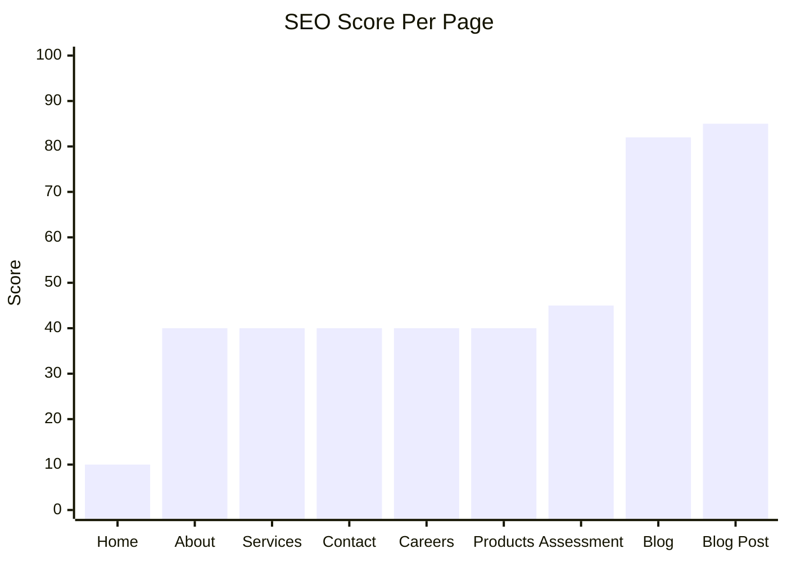
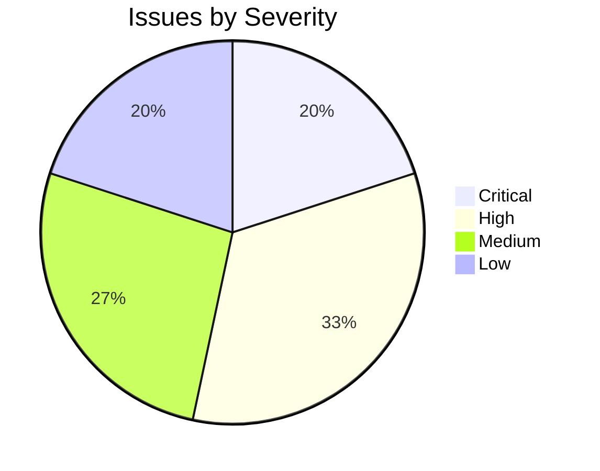
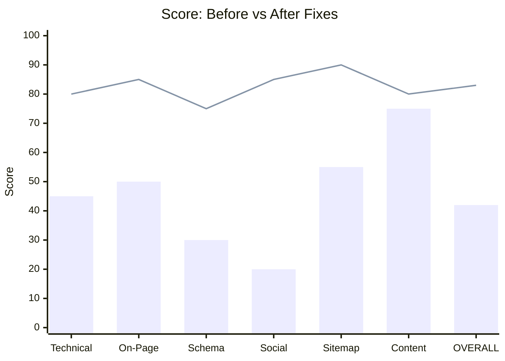
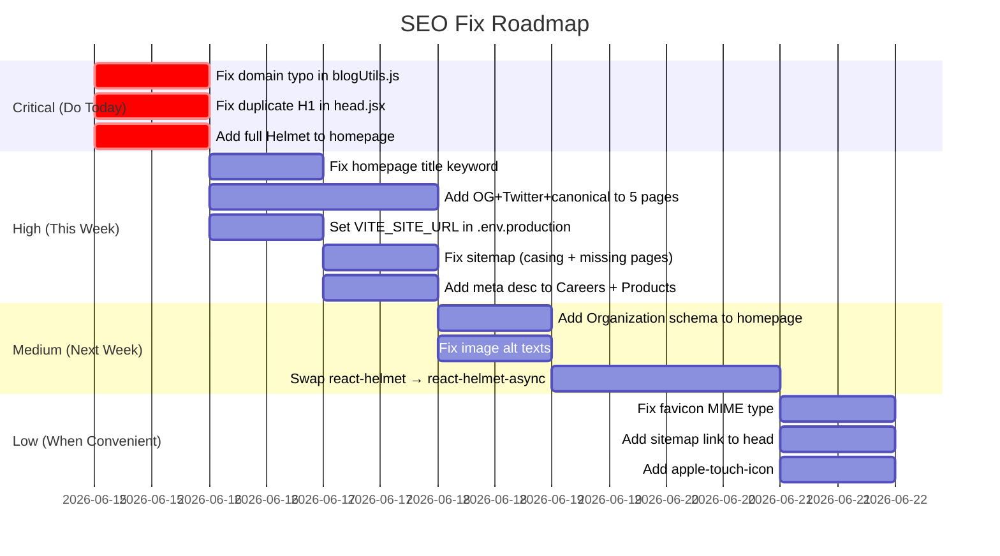

# SEO Audit Report — Global Cyber Associates
**Date:** June 15, 2026  
**Site:** globalcyberassociates.com  
**Audited From:** Source code at `d:\Companies\GCA\website - Copy`

---

## Overall Score

```
┌─────────────────────────────────────────────────────────────────┐
│                                                                 │
│   OVERALL SEO SCORE                                             │
│                                                                 │
│   ████████████████████░░░░░░░░░░░░░░░░░░░░░  42 / 100          │
│                                                                 │
│   Rating: POOR — Significant gaps across core pages            │
│                                                                 │
└─────────────────────────────────────────────────────────────────┘
```

---

## Score by Category

```mermaid
radar
  title SEO Category Scores (out of 100)
  "Technical SEO" : 45
  "On-Page SEO" : 50
  "Structured Data" : 30
  "Social Sharing" : 20
  "Sitemap & Crawlability" : 55
  "Content & Blog" : 75
```

| Category | Score | Status |
|---|---|---|
| Technical SEO | 45 / 100 | Poor |
| On-Page SEO | 50 / 100 | Needs Work |
| Structured Data / Schema | 30 / 100 | Critical |
| Social Sharing (OG / Twitter) | 20 / 100 | Critical |
| Sitemap & Crawlability | 55 / 100 | Needs Work |
| Content & Blog | 75 / 100 | Good |

---

## Page-by-Page Score



```
Page              Score   Bar
─────────────────────────────────────────────────────────
Homepage          10/100  ██░░░░░░░░░░░░░░░░░░░░░░░░░░░░
About             40/100  ████████████░░░░░░░░░░░░░░░░░░
Services          40/100  ████████████░░░░░░░░░░░░░░░░░░
Contact           40/100  ████████████░░░░░░░░░░░░░░░░░░
Careers           40/100  ████████████░░░░░░░░░░░░░░░░░░
Products          40/100  ████████████░░░░░░░░░░░░░░░░░░
Assessment        45/100  █████████████░░░░░░░░░░░░░░░░░
Blog Index        82/100  ████████████████████████░░░░░░
Blog Post         85/100  █████████████████████████░░░░░
─────────────────────────────────────────────────────────
AVERAGE           42/100  ████████████░░░░░░░░░░░░░░░░░░
```

---

## Issues Overview



```
Severity    Count   Visual
──────────────────────────────────
Critical      3     🔴🔴🔴
High          5     🟠🟠🟠🟠🟠
Medium        4     🟡🟡🟡🟡
Low           3     🔵🔵🔵
──────────────────────────────────
Total        15
```

---

## What Each Page Has (SEO Checklist)

```
                     title  desc  OG  Twitter  Canonical  Schema  H1
─────────────────────────────────────────────────────────────────────
Homepage (/)           ✅    ❌   ❌    ❌        ❌        ❌     ⚠️
About (/about)         ✅    ✅   ❌    ❌        ❌        ❌     ✅
Services (/solutions)  ✅    ✅   ❌    ❌        ❌        ❌     ✅
Contact (/contact)     ✅    ✅   ❌    ❌        ❌        ❌     ✅
Careers (/careers)     ✅    ❌   ❌    ❌        ❌        ❌     ✅
Products (/products)   ✅    ❌   ❌    ❌        ❌        ❌     ✅
Assessment             ✅    ✅   ❌    ❌        ❌        ❌     ✅
Blog Index (/blog)     ✅    ✅   ✅    ✅        ✅        ✅     ✅
Blog Post              ✅    ✅   ✅    ✅        ✅        ✅     ✅
─────────────────────────────────────────────────────────────────────
✅ Present  ❌ Missing  ⚠️ Duplicate/Wrong
```

---

## All Issues — Full List

### 🔴 CRITICAL

---

#### C1 · Homepage has NO meta description, OG, Twitter, canonical, or structured data
- **File:** [`index.html`](index.html) + [`src/components/homepage/home.jsx`](src/components/homepage/home.jsx)
- **Impact:** Google scrapes a random snippet. Links shared on LinkedIn/WhatsApp show no image or preview. Zero rich result eligibility.
- **Fix:** Add a `<Helmet>` block to `home.jsx` with all required tags.

```jsx
// Add to home.jsx
import { Helmet } from 'react-helmet-async';

<Helmet>
  <title>Cybersecurity Services for Startups & MSMEs | Global Cyber Associates</title>
  <meta name="description" content="Global Cyber Associates delivers enterprise-grade cybersecurity — VAPT, compliance, SOC, and training — right-sized for startups and MSMEs. Get your free risk assessment." />
  <meta name="robots" content="index,follow" />
  <link rel="canonical" href="https://www.globalcyberassociates.com/" />
  <meta property="og:type" content="website" />
  <meta property="og:title" content="Cybersecurity Services for Startups & MSMEs | Global Cyber Associates" />
  <meta property="og:description" content="Enterprise-grade cybersecurity right-sized for your business. VAPT, compliance, SOC, training." />
  <meta property="og:url" content="https://www.globalcyberassociates.com/" />
  <meta property="og:image" content="https://www.globalcyberassociates.com/og-cover.png" />
  <meta name="twitter:card" content="summary_large_image" />
  <meta name="twitter:title" content="Cybersecurity Services for Startups & MSMEs | GCA" />
  <meta name="twitter:description" content="Enterprise-grade cybersecurity right-sized for your business." />
  <meta name="twitter:image" content="https://www.globalcyberassociates.com/og-cover.png" />
  <script type="application/ld+json">{JSON.stringify(orgSchema)}</script>
</Helmet>
```

---

#### C2 · Duplicate `<h1>` on every page — logo uses `<h1>` tag
- **File:** [`src/components/head.jsx:62`](src/components/head.jsx#L62)
- **Impact:** Every page has two H1s — one in the nav (logo text) and one in the page body. Google treats this as a structural error and downgrades keyword signals.
- **Fix:** Change `<h1>` to `<span>` in the logo.

```jsx
// Before (head.jsx line 62)
<h1>GlobalCyberAssociates</h1>

// After
<span className="logo-text">GlobalCyberAssociates</span>
```

---

#### C3 · Domain typo in `blogUtils.js` — canonical URLs point to wrong domain
- **File:** [`src/pages/blogUtils.js:5`](src/pages/blogUtils.js#L5)
- **Impact:** If `VITE_SITE_URL` is not set, every blog canonical URL, OG URL, and JSON-LD points to `globalcyberassociate.com` (missing the **s**). Google may index the wrong domain.

```js
// Before
const FALLBACK_SITE_URL = "https://www.globalcyberassociate.com";

// After
const FALLBACK_SITE_URL = "https://www.globalcyberassociates.com";
```

---

### 🟠 HIGH

---

#### H1 · Homepage `<title>` has no keywords
- **File:** [`index.html:8`](index.html#L8)
- **Current:** `Global Cyber Associates`
- **Fix:** 
  ```html
  <title>Cybersecurity Services for Startups & MSMEs | Global Cyber Associates</title>
  ```
- **Note:** This base title is overridden by `<Helmet>` on pages that have it, but the homepage currently doesn't — so this is the title Google sees for your most important page.

---

#### H2 · About, Services, Contact, Careers, Products pages missing OG + Twitter + canonical
- **Files:** `about.jsx`, `service.jsx`, `contact.jsx`, `careers.jsx`, `products.jsx`
- **Impact:** No controlled preview when shared on social media. No canonical signals for duplicate detection.
- **Fix:** Add to each page's `<Helmet>`:

```jsx
<link rel="canonical" href="https://www.globalcyberassociates.com/about" />
<meta property="og:type" content="website" />
<meta property="og:title" content="About Us | Global Cyber Associates" />
<meta property="og:description" content="Built by defenders, for every business..." />
<meta property="og:url" content="https://www.globalcyberassociates.com/about" />
<meta property="og:image" content="https://www.globalcyberassociates.com/og-cover.png" />
<meta name="twitter:card" content="summary_large_image" />
<meta name="twitter:title" content="About Us | Global Cyber Associates" />
<meta name="twitter:description" content="Built by defenders, for every business..." />
<meta name="twitter:image" content="https://www.globalcyberassociates.com/og-cover.png" />
```

---

#### H3 · `VITE_SITE_URL` environment variable not set
- **Impact:** The `getSiteUrl()` function in `blogUtils.js` falls back to the typo domain during production builds if this env var is absent.
- **Fix:** Create a `.env.production` file:

```env
VITE_SITE_URL=https://www.globalcyberassociates.com
```

---

#### H4 · Sitemap is incomplete and has a casing bug
- **File:** [`public/sitemap.xml`](public/sitemap.xml)

```
Current issues:
  /Solutions   ← wrong case (should be /solutions)
  /products    ← missing
  /assessment  ← missing
  /blog/cybersecurity-tips                          ← missing
  /blog/web-application-security-for-developers    ← missing
  No <lastmod> dates on any URL
```

**Fixed sitemap.xml:**
```xml
<?xml version="1.0" encoding="UTF-8"?>
<urlset xmlns="http://www.sitemaps.org/schemas/sitemap/0.9">
  <url><loc>https://www.globalcyberassociates.com/</loc><lastmod>2026-06-15</lastmod><priority>1.0</priority></url>
  <url><loc>https://www.globalcyberassociates.com/about</loc><lastmod>2026-06-15</lastmod><priority>0.8</priority></url>
  <url><loc>https://www.globalcyberassociates.com/solutions</loc><lastmod>2026-06-15</lastmod><priority>0.9</priority></url>
  <url><loc>https://www.globalcyberassociates.com/products</loc><lastmod>2026-06-15</lastmod><priority>0.8</priority></url>
  <url><loc>https://www.globalcyberassociates.com/careers</loc><lastmod>2026-06-15</lastmod><priority>0.6</priority></url>
  <url><loc>https://www.globalcyberassociates.com/contact</loc><lastmod>2026-06-15</lastmod><priority>0.7</priority></url>
  <url><loc>https://www.globalcyberassociates.com/blog</loc><lastmod>2026-06-15</lastmod><priority>0.8</priority></url>
  <url><loc>https://www.globalcyberassociates.com/blog/cybersecurity-tips</loc><lastmod>2026-06-15</lastmod><priority>0.7</priority></url>
  <url><loc>https://www.globalcyberassociates.com/blog/web-application-security-for-developers</loc><lastmod>2026-06-15</lastmod><priority>0.7</priority></url>
  <url><loc>https://www.globalcyberassociates.com/assessment</loc><lastmod>2026-06-15</lastmod><priority>0.9</priority></url>
</urlset>
```

---

#### H5 · Careers and Products pages missing meta description
- **Files:** `careers.jsx`, `products.jsx`
- **Impact:** Google auto-generates a poor snippet for these pages.
- **Fix (careers.jsx):**
  ```jsx
  <meta name="description" content="Join Global Cyber Associates — work with elite security professionals in a hybrid-first culture. View open roles in cybersecurity, research, and operations." />
  ```
- **Fix (products.jsx):**
  ```jsx
  <meta name="description" content="Explore GCA's proprietary cybersecurity products including Visun — an AI-powered threat visibility platform built for modern infrastructure." />
  ```

---

### 🟡 MEDIUM

---

#### M1 · No Organization schema on homepage
- **Impact:** No eligibility for Google Knowledge Panel or rich brand results.
- **Fix:** Add JSON-LD to `home.jsx`:

```js
const orgSchema = {
  "@context": "https://schema.org",
  "@type": "Organization",
  name: "Global Cyber Associates",
  url: "https://www.globalcyberassociates.com",
  logo: "https://www.globalcyberassociates.com/logo.png",
  contactPoint: {
    "@type": "ContactPoint",
    email: "info@globalcyberassociates.com",
    contactType: "customer support"
  },
  sameAs: []
};
```

---

#### M2 · Hero image alt text is generic
- **File:** [`src/components/homepage/hero/hero.jsx:92`](src/components/homepage/hero/hero.jsx#L92)
- **Before:** `alt="Security Illustration"`
- **After:** `alt="Global Cyber Associates cybersecurity platform dashboard overview"`

---

#### M3 · Logo alt text is generic
- **File:** [`src/components/head.jsx:61`](src/components/head.jsx#L61)
- **Before:** `alt="Company Logo"`
- **After:** `alt="Global Cyber Associates"`

---

#### M4 · `react-helmet` is deprecated — replace with `react-helmet-async`
- **Files:** All pages using `import { Helmet } from 'react-helmet'`
- **Impact:** `react-helmet` has known memory leaks and race conditions in React 18. Can cause hydration mismatches if SSR/prerendering is added later.
- **Fix:**
  ```bash
  npm uninstall react-helmet
  npm install react-helmet-async
  ```
  Wrap your app root in `<HelmetProvider>` in `main.jsx`, then change all imports from `react-helmet` to `react-helmet-async`.

---

### 🔵 LOW

---

#### L1 · Favicon MIME type mismatch
- **File:** [`index.html:6`](index.html#L6)
- **Before:** `<link rel="icon" type="image/svg+xml" href="/logo.png" />`
- **After:** `<link rel="icon" type="image/png" href="/logo.png" />`

---

#### L2 · No sitemap link in `<head>`
- **File:** [`index.html`](index.html)
- **Fix:**
  ```html
  <link rel="sitemap" type="application/xml" href="/sitemap.xml" />
  ```

---

#### L3 · No apple-touch-icon
- **File:** [`index.html`](index.html)
- **Fix:**
  ```html
  <link rel="apple-touch-icon" href="/logo.png" />
  ```

---

## Projected Score After All Fixes



```
Category          Before   After    Gain
──────────────────────────────────────────
Technical SEO      45      80      +35
On-Page SEO        50      85      +35
Structured Data    30      75      +45
Social Sharing     20      85      +65
Sitemap            55      90      +35
Content / Blog     75      80      +05
──────────────────────────────────────────
OVERALL            42      83      +41
```

---

## Fix Priority Roadmap



---

## Issue Summary Table

| ID | Issue | File | Severity | Score Impact |
|---|---|---|---|---|
| C1 | Homepage missing desc / OG / canonical / schema | `home.jsx` | 🔴 Critical | -25 pts |
| C2 | Duplicate H1 — logo tag on every page | `head.jsx:62` | 🔴 Critical | -10 pts |
| C3 | Domain typo in fallback URL | `blogUtils.js:5` | 🔴 Critical | -8 pts |
| H1 | Homepage title has no keywords | `index.html:8` | 🟠 High | -5 pts |
| H2 | 5 pages missing OG + Twitter + canonical | multiple | 🟠 High | -8 pts |
| H3 | VITE_SITE_URL not set | `.env` missing | 🟠 High | -5 pts |
| H4 | Sitemap casing bug + 4 missing pages | `sitemap.xml` | 🟠 High | -4 pts |
| H5 | Careers + Products missing meta description | 2 files | 🟠 High | -3 pts |
| M1 | No Organization schema on homepage | `home.jsx` | 🟡 Medium | -3 pts |
| M2 | Hero image alt text generic | `hero.jsx:92` | 🟡 Medium | -1 pt |
| M3 | Logo alt text generic | `head.jsx:61` | 🟡 Medium | -1 pt |
| M4 | react-helmet deprecated | all pages | 🟡 Medium | -2 pts |
| L1 | Favicon MIME type mismatch | `index.html:6` | 🔵 Low | -0.5 pt |
| L2 | No sitemap link in `<head>` | `index.html` | 🔵 Low | -0.5 pt |
| L3 | No apple-touch-icon | `index.html` | 🔵 Low | -0.5 pt |

---

## What's Already Good ✅

| Item | Status |
|---|---|
| `lang="en"` on `<html>` tag | ✅ |
| Blog pages have full SEO (OG, Twitter, canonical, JSON-LD) | ✅ |
| `robots.txt` allows all crawlers and references sitemap | ✅ |
| RSS feed at `/rss.xml` | ✅ |
| Lazy loading on blog images | ✅ |
| Heading hierarchy inside pages is correct | ✅ |
| `<meta name="robots" content="index,follow">` on blog pages | ✅ |
| Google Fonts preconnect hints | ✅ |
| AOS animation library (does not harm SEO) | ✅ |
| Sitemap domain is correct (`globalcyberassociates.com`) | ✅ |

---

*Report generated by Claude Code · Global Cyber Associates SEO Audit · June 15, 2026*
